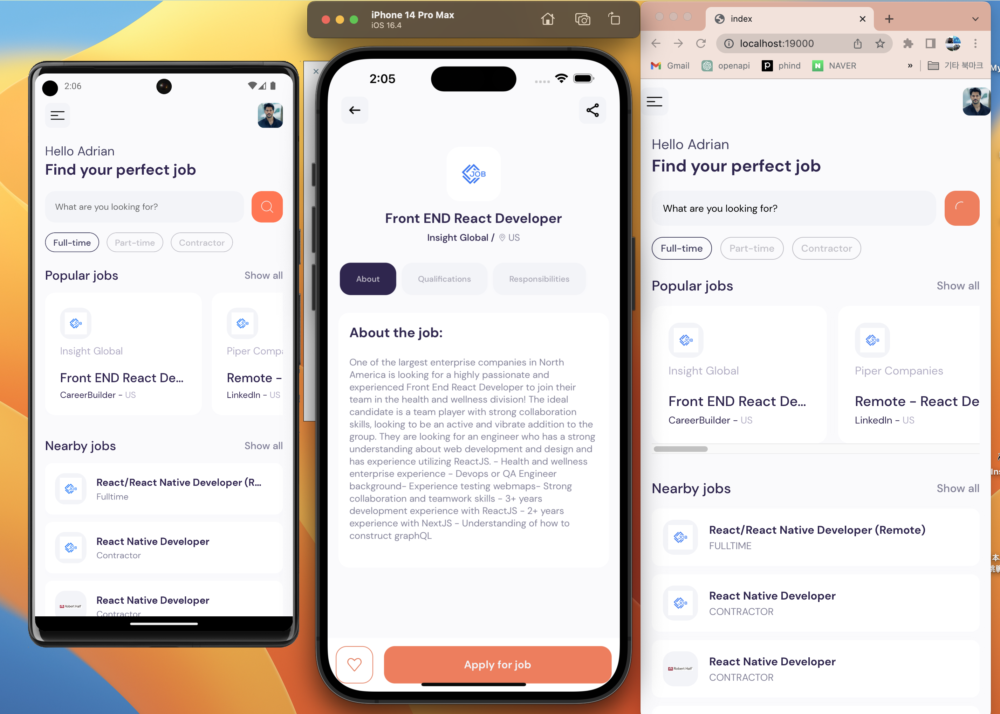

# 프로젝트명: 잡파인더 (JobFinder)
> Rapid API를 이용하여 직업타입, 직업군, 거리 순의 Job Finding을 수행합니다.

> [Next JS & Open AI / GPT: Next-generation]   


"당신의 꿈을 이루는 일자리를 찾아보세요! Job Finder는 전 세계 수많은 기업들과 연결되어 있는 신뢰할 수 있는 플랫폼입니다. 다양한 산업 분야에서 최신의 일자리 정보와 기업들의 채용 공고를 제공하여 당신에게 딱 맞는 일자리를 찾을 수 있도록 도와드립니다. 진로를 고민하거나 새로운 기회를 찾고 계신다면, Job Finder와 함께 미래를 여는 문을 열어보세요!"





# Expo Router Example

Use [`expo-router`](https://expo.github.io/router) to build native navigation using files in the `app/` directory.

## 🚀 How to use

```sh
npx create-expo-app -e with-router
```

## 📝 Notes

- [Expo Router: Docs](https://expo.github.io/router)
- [Expo Router: Repo](https://github.com/expo/router)
